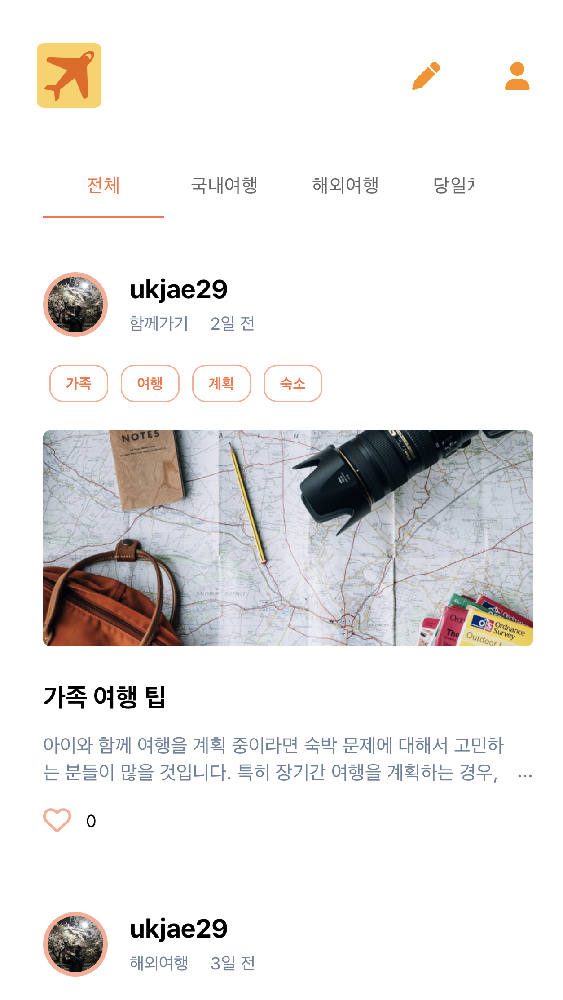
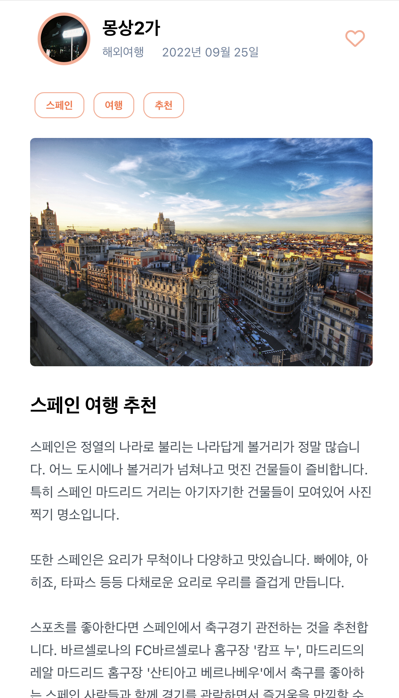

# My Traveltory

> 여행의 느낌을 나만의 감성으로 기록하고 공유하는 여행경험 공유 어플리케이션 [My Traveltory ✈️](https://my-traveltory.web.app/)

> 자세한 정보는 ['포트폴리오'로 이동 🚗](https://ukjae-portfolio.vercel.app/projects/myTraveltory)

<br>
<br>

<p>

 &nbsp; &nbsp; &nbsp;

</p>

<br>
<br>

## 🎙️ Description

My Traveltory는 나만의 여행스토리를 일기처럼 적어서 많은 사람과 공유할 수 있는 어플리케이션입니다. 나만의 여행을 계획하고 구성하는데 도움을 줄 수 있는 앱이 될 수 있기를 바라는 마음으로 기획하였습니다.

<br>

## 💡 Main Feature

### 스토리 등록 및 조회 기능

- 스토리 등록, 수정, 삭제

- 스토리 상세조회

- 스토리 카테고리별, 태그별 조회

### 스토리 `좋아요` 표시 가능

- 하트를 눌러 마음에 드는 스토리 체크 가능

### 나만의 스토리 조회 가능

- 프로필 페이지에서 내가 작성한 페이지만 확인 가능

<br>

## 🖥️ Getting Started

### Installation

```sh
git clone https://github.com/Gryffindor0ne/traveltory.git
npm install
```

### Develop Mode

```sh
npm run start
```

<br>

## ⛵️ Stack

🖥️ Frontend : React, TypeScript, Redux, Styled-Components<br><br>
🧺 Backend : Firebase<br><br>
🎉 Deployment : Firebase

<br>

## 🪜 Project Structure

```
├─ src
│  ├─ App.test.tsx
│  ├─ Routes
│  │  ├─ Auth.tsx
│  │  ├─ Main.tsx
│  │  ├─ NewStory.tsx
│  │  ├─ Profile.tsx
│  │  └─ Story.tsx
│  ├─ apis
│  │  └─ f-base.js
│  ├─ common
│  │  └─ tags
│  │     └─ index.ts
│  ├─ components
│  │  ├─ App.tsx
│  │  ├─ EditStory.tsx
│  │  ├─ Router.tsx
│  │  ├─ ShortStories.tsx
│  │  ├─ layout
│  │  │  ├─ Category.tsx
│  │  │  ├─ ImageUploadForm.tsx
│  │  │  ├─ Likes.tsx
│  │  │  ├─ LoadingIndicator.tsx
│  │  │  ├─ NavBar.tsx
│  │  │  ├─ Tabs.tsx
│  │  │  ├─ Tags.tsx
│  │  │  └─ TopButton.tsx
│  │  └─ naverLogin.tsx
│  ├─ index.css
│  ├─ index.tsx
│  ├─ react-app-env.d.ts
│  ├─ redux
│  │  ├─ hooks
│  │  │  └─ reduxHooks.ts
│  │  ├─ slices
│  │  │  ├─ loginSlice.ts
│  │  │  ├─ storySlice.ts
│  │  │  └─ userSlice.ts
│  │  └─ store.ts
│  ├─ setupTests.ts
│  └─ utils
│     └─ dateUtils.ts
├─ tsconfig.json
└─ tsconfig.paths.json
```

©generated by [Project Tree Generator](https://woochanleee.github.io/project-tree-generator)

---

<br>

<p align='center'>
   
    
    
    
    
    
</p>
